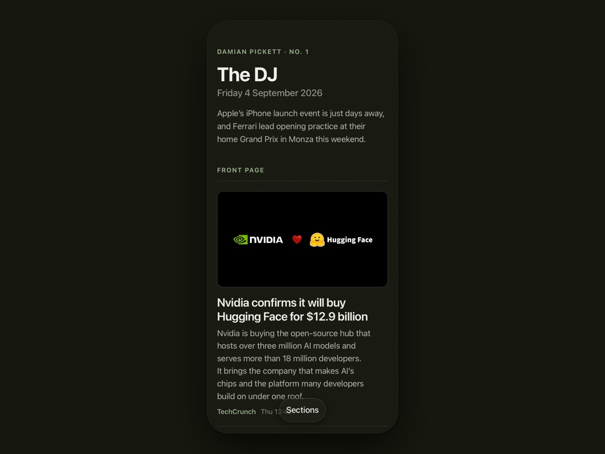

# The DJ

Damian Pickett's morning paper, named for Damian Jr. Live at [daily.damianpickett.com](https://daily.damianpickett.com).



**The problem.** News apps decide what you see with feeds, algorithms and paywalls, and the things I follow (film, AI, technology, Apple, five teams) never sit in one place.

**The act.** Every morning at six, an AI editor reads 55 sources I chose, all free to read, and publishes one calm page: three front-page stories, one thing to read, three things to listen to, and each section in two sentences and a link. The editorial rules it follows are written down in [`ROUTINE.md`](ROUTINE.md), which doubles as the prompt.

**What I learned building it.** A written editorial spec beats a clever prompt; a validator that refuses bad output beats trust; and the right unit of product is one memorable act, finished. Once a morning an editor (Claude, running as a scheduled routine) reads the last day's news from a fixed list of ungated sources, picks what matters across film, AI, technology, Apple and five teams, writes a two-sentence summary of each, chooses a Lenny's Newsletter post and a podcast episode for the day, and publishes a static page in the style of [damianpickett.com](https://damianpickett.com).

No framework, no database, no dependencies. Two Node scripts, some JSON and static HTML on Vercel.

## Make your own

Use **Use this template** on GitHub to create a separate paper in your own account, then give your Claude Code the [starter prompt](docs/STARTER-PROMPT.md). The [customisation guide](docs/MAKE-YOUR-OWN.md) maps sources, sections, recommendations, design and scheduling to the files that control them. It also covers a first preview and setting up your own hosting and routine. `CLAUDE.md` is the entry point for the coding assistant; `ROUTINE.md` remains the daily editorial specification.

## How it works

```
sources.json ──▶ scripts/fetch.mjs ──▶ _build/candidates.md ──▶ the editor ──▶ editions/DATE.json
                                                                                     │
                                                              scripts/build.mjs ◀────┘
                                                                     │
                                          index.html · editions/DATE.html · archive.html · sources.html
```

- `sources.json`: every feed, grouped by topic, plus the newsletter and the podcasts. Edit this to change what the paper reads.
- `scripts/fetch.mjs`: fetches the feeds (RSS and Atom, parsed without a library, pictures included), keeps the last 30 hours, drops anything used in the last seven editions, refreshes `data/lenny.json` (the newsletter's archive, with cover images) and `data/podcasts.json` (every episode of the three shows, with Apple Podcasts links, artwork and YouTube links matched from each channel's feed), flags what is new since the last edition, and writes `_build/candidates.md`.
- `ROUTINE.md`: the editor's instructions. The scheduled routine is told to read this file and follow it; the editorial rules live here, in the repository, not in the scheduler.
- `editions/YYYY-MM-DD.json`: one file per edition, the source of truth. The schema is in `ROUTINE.md`.
- `scripts/build.mjs`: fills in what the editor did not write (source, timestamp, a picture from the feed or the article's share image, the newsletter's cover, an episode's artwork and YouTube link), validates every edition (and refuses to build a broken one), writes the filled-in edition back, then renders the pages.
- `css/site.css` and the menu in `js/daily.js` are copied from damianpickett.com so the paper matches the site. `css/daily.css` holds the newspaper components.

## Run it locally

```
node scripts/fetch.mjs        # candidates for this morning
node scripts/build.mjs        # render every edition
npx serve -l 3456 .           # open http://localhost:3456
```

Node 18 or newer. `node scripts/build.mjs --check` validates without writing.

`npm test` checks generated navigation, preservation of stories, quiet-day sections and editions without images. It uses a frozen edition in `tests/fixtures/`, so the tests do not depend on the current news or a network connection.

## Deploy

The repository root is the site, served at https://daily.damianpickett.com. Vercel deploys `main` on push; `.vercelignore` keeps the scripts, data and notes out of the deployment. Manual deploy: `npx vercel deploy --prod`.

## The routine

A Claude Code cloud routine runs every morning at 06:00 London time with the prompt "Read ROUTINE.md and do this morning's edition", against this repository. It commits the edition to `main`, which deploys. See `ROUTINE.md` for exactly what it does and how it fails safely.

The cloud environment the routine runs in must allow outbound HTTPS to the feed domains. The default `Trusted` network level only reaches package registries, so every feed fails with a proxy 403 and the routine correctly refuses to publish; set the environment's network access to full, or allow the feed domains, at claude.ai/code.

## Design notes

- Mobile first: the paper opens on three highlights and the closing good story. Topic shortcuts near the masthead show each section's story count. The fixed bottom bar keeps Highlights, Listen and Sections in reach.
- A topic opens on its own. The section picker also has direct team links, the daily read, archive, sources and a Whole edition option. Listen jumps directly to the podcasts, with the read above them. Empty topics and teams have no shortcut.
- Stories retain their source, two-sentence summary and picture. The lead highlight, section leads and closing story have wide pictures; supporting highlights use thumbnails. The whole story row remains the link, and visited stories fade.
- Section URLs use hashes (`#ai`, `#listen`, `#sport-f1`). Back and Forward restore the selected view. The picker supports keyboard navigation, traps focus and closes with Escape. Switching sections does not animate a long scroll.
- Every article stays in the generated HTML. Without JavaScript, the original continuous paper and anchor links remain usable. Printing includes all sections. The source JSON and morning editorial routine keep their existing schema and counts.
- Add to Home Screen on iPhone and it opens full screen, with the masthead kept clear of the status bar.

Navigation lives in `sectionLinksHtml()` / `editionNavigationHtml()` in `scripts/build.mjs`, the edition-view block in `js/daily.js`, and the final section of `css/daily.css`. Bump `ASSET_VERSION` in the build script when changing shared CSS or JavaScript, then rebuild all editions to avoid stale cached controls.
